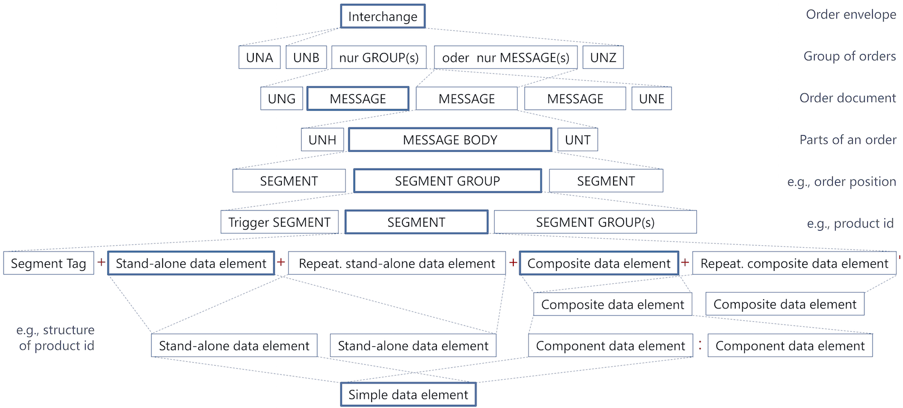

# Segments

## EDIFACT Segment Definition

EDIFACT Segment is a collection of logically-related data elements in a fixed, defined sequence. 

### EDIFACT provides a hierarchical structure for messages
 
EDIFACT messages begin with the `Message Header Segment` (UNH) and end with the` Message Trailer Segment` (UNT). 
These two segments are the first, and innermost, level of the three levels of “electronic envelopes” within EDIFACT.

EDIFACT Segment contains:

* A **three-character alphanumeric** code that identifies the segment. This is called the segment tag.
* Variable length data elements. These can be either simple or composite.

Segments must be separated by a **data element separator/delimiter**, which is normally `+` and `:`, and 
terminated by a segment terminator, normally `'`.

Good to know: 

> Each EDIFACT Segment is fully documented in the "United Nations Trade Data Interchange Directory" (UNTDID). 
These tables list the segment position, segment tag and segment name. 
EDIFACT Segment tables also specify if a segment must appear in a message using the requirements' designator
`M` (Mandatory) or `C` (Conditional), and how many times a particular segment may repeat (repetition field).

### There are two kinds of segments

* [Service Segments](service-segments-spec.md)
* Generic Segments

#### Service Segments

* Envelopes (`UNB`-`UNZ`, `UNG`-`UNE`, `UNH`-`UNT`)
* Delimiter String Advice (`UNA`)
* Section Separator (`UNS`)

#### Generic Segments

* `DOC` to identify and specify documents
* `MOA` for monetary amounts
* `DTM` for dates and times
* `NAD` for name and address data
* And others...

#### EDIFACT Segment Terminators and Delimiters

The end of each segment is determined by the Data Segment Terminator. 
In EDIFACT the standard data segment terminator is `'`.
 
---
## Structure



An interchange consists of:

```
            Service String Advice     UNA   Conditional
     _____  Interchange Header        UNB   Mandatory
    |  ___  Functional Group Header   UNG   Conditional
    | |  _  Message Header            UNH   Mandatory
    | | |   User Data Segments              As required
    | | |_  Message Trailer           UNT   Mandatory
    | |___  Functional Group Trailer  UNE   Conditional
    |_____  Interchange Trailer       UNZ   Mandatory

In addition to the above service segments, the service
segment UNS can, when required, be used to divide a message
into sections. See annex B.


-----------------------------------------
|Establishment |CONNECTION| Termination |  A CONNECTION contains one
--------------------|--------------------  or more interchanges. The
                    |                      technical protocols for
                    |                      for establishment
                    |                      maintenance and
                    |                      termination etc.are not
+-------------------+-------------------+  part of this standard.
|                                       |
-----------------------------------------
|Interchange |INTERCHANGE |Interchange  |  An INTERCHANGE contains:
-------------------|---------------------  - UNA, Service string advice, if used
                   |                       - UNB, Interchange header
                   |                       - Either only Functional groups, 
                   |                         if used, or only Messages
                   |
.....--------------+--------------------+  - UNZ, Interchange trailer
.   |                                   |
-----------------------------------------
|UNA|UNB|'|    Either   |or only  |UNZ|'| A FUNCTIONAL GROUP contains
|   |   | |FUNCTION.GRPS|MESSAGES |   | |  - UNG, Functional group
-----------------|----------.------------    header
                 |          .              - Messages of the same
                 |          .                type
+----------------+----------.-----------+  - UNE, Functional group
|               +........+..+           |    trailer
|               .        .              |
-----------------------------------------
|UNG |'|Message |MESSAGE |Message |UNE|'|  A MESSAGE contains:
--------------------|--------------------  - UNH, Message header
                    |                      - Data segments
+-------------------+-------------------+  - UNT, Message trailer
|                                       |
-----------------------------------------
|UNH |'|Data    |DATA    |Data    |UNT|'|  A SEGMENT contains:
|    | |segment |SEGMENT |segment |   | |  - A Segment TAG
-------------------|---------------------  - Simple data elements or
                   |                       - Composite data elements
+------------------+-------------------+     or both as applicable
|                                      |
----------------------------------------
|TAG |+|SIMPLE       |+|COMPOSITE    |'|   A SEGMENT TAG contains:
|    | |DATA ELEMENT | |DATA ELEMENT | |   - A segment code and,
---|--------------|----------|-----|----     if explicit indication,
   |              |          |     |         repeating and nesting
   |              |          |     |         value(s). 
   |              |          |     |
   |              |          |     |   A SIMPLE DATA ELEMENT contains
--------------   -------   -------------   - A single data element
|Code|:|Value|   |Value|   |COMP|:|COMP|     value
--------------   -------   |D/E | |D/E |   A COMPOSITE DATA ELEMENT
                           |    | |    |   contains:
                           --|------|---   - Component data elements
                             |      |
                         ------- -------  A COMPONENT DATA ELEMENT
                         |     | |     |  contains:
                         |Value| |Value|  - A single data element
                         ------- -------    value

  --.--                  --|--
    . means alternative to |
```

## References

* [EDIFACT | Wikipedia](https://en.wikipedia.org/wiki/EDIFACT)
* [Edifact Segment | Ediacademy](https://ediacademy.com/blog/edifact-segment/)
* [Structures | unece](http://www.unece.org/fileadmin/DAM/trade/edifact/untdid/d422_s.htm#structures)
